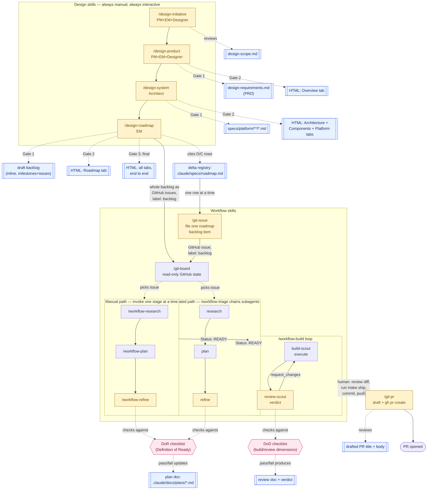

# .claude/ — agent configuration for this repo

This directory configures Claude Code for the nonprofit-success-ai repo: a library of
**skills** (multi-step workflows an agent runs on command), **agents** (single-purpose
subagents dispatched by skills), and **specs** (the durable documents skills read and
write). If you're wiring up a different agent CLI (Codex, Gemini CLI, etc.) against this
repo, this doc explains what each piece does and what to port vs. adapt — see
[Porting to another agent CLI](#porting-to-another-agent-cli) at the bottom.

## Directory map

```
.claude/
├── skills/    workflow definitions — one directory per skill, SKILL.md inside
├── agents/    subagent definitions — dispatched BY skills, never invoked directly by a person
├── specs/     durable, tracked specs — data models, agent contracts, design decisions
├── docs/      working documents — plans, research, telemetry. Git-ignored (see below).
└── README.md  this file
```

**Tracked vs. git-ignored matters here.** `skills/`, `agents/`, and `specs/` are
committed — they're the shared configuration every contributor and every session reads.
`docs/` is listed in `.gitignore` (`.claude/docs/`) — it holds this session's scratch
work (plan docs, research docs, telemetry JSONL). Anything that must be visible to other
collaborators belongs in the top-level `docs/` directory instead (tracked), not
`.claude/docs/`.

## The pipeline, end to end

Two skill families, each with a different relationship to automation. **Design skills**
are always manual, always interactive — one invocation per stage, every stage pauses for
review. **Workflow skills** offer both a manual path (invoke `/workflow-research`,
`/workflow-plan`, `/workflow-refine` yourself, one at a time, full control) and an
automated path (`/workflow-triage` chains all three as subagents, `/workflow-build`
chains execute → review → fix) — the automation still gates on the same decisions, it
just gates in sequence instead of waiting for you to re-invoke it every step.



**Every yellow box is a HITL gate; every blue box is the document it pauses on; the two
pink checklists (DoR, DoD) are the pass/fail criteria `/workflow-refine` and
`/workflow-review` apply before anything downstream proceeds.** See the table below for
exact detail on each one.

**`workflow-build` never commits, pushes, or opens anything.** Its loop ends when review
returns `approve` and the changes sit staged on the branch. Everything from there is the
human's: review the diff, run `make ship` (lint, type-check, test, build — gate only, it
does not push), commit, push. `/git-pr` picks up only after the branch is on the
remote — it drafts the PR body from the plan doc and diff and stops for approval before
`gh pr create` runs. Claude never pushes at any point in this sequence.

## Legend — what document to open at each design gate

The diagram shows *where* the design flow pauses; this is *what file to have open* when
it does. Every design-skill gate pauses on one of these two documents — never on both at
once, and never on the rendered HTML before its own gate has passed.

| Stage | Open this to review | Format |
|---|---|---|
| `/design-initiative` | `.claude/specs/design-scope.md` (sections presented as written) | markdown, tracked |
| `/design-product` Gate 1 | `.claude/specs/design-requirements.md` (the PRD) | markdown, tracked |
| `/design-product` Gate 2 | `docs/<project>-system-design.html` — Overview tab only | HTML, tracked |
| `/design-system` Gate 1 | `.claude/specs/platform/{agents,services,infra}/*.md` (new/updated specs) | markdown, tracked |
| `/design-system` Gate 2 | `docs/<project>-system-design.html` — Architecture/Components/Platform tabs | HTML, tracked |
| `/design-roadmap` Gate 1 | the draft backlog printed inline (milestones, issues, dependency map) — not yet a file | terminal output |
| `/design-roadmap` Gate 2 | `docs/<project>-system-design.html` — Roadmap tab | HTML, tracked |
| Gate 3 (final) | `docs/<project>-system-design.html` — all tabs | HTML, tracked |
| `/git-issue` | the drafted issue body per delta, printed inline before `gh issue create` runs | terminal output |
| `/workflow-refine`, `/workflow-triage` | the plan doc, `.claude/docs/plans/<date>-<slug>.md`, `### Open Questions` section | markdown, git-ignored |
| `/workflow-review` (inside `/workflow-build`) | the review doc it writes, plus the diff itself | markdown + diff |
| `/git-pr` | the drafted PR body, printed inline before `gh pr create` runs | terminal output |

## HITL gates — what gets reviewed, and when

The design skills build one HTML design record **incrementally**: each phase writes its
own draft to `.claude/docs/` first, pauses for review on that draft (not the HTML), and
only renders its section of the HTML after approval. Nothing renders to HTML until the
underlying design is reviewed; nothing gets filed to GitHub until the complete HTML has
been reviewed end to end.

| Skill | Creates (`.claude/docs/` draft) | HITL gate | Adds to HTML (`docs/<project>-system-design.html`) |
|---|---|---|---|
| `/design-initiative` | design doc sections, presented one at a time | approve each section before it's written | *(no HTML yet — this stage only writes `specs/design-scope.md`)* |
| `/design-product` | PRD draft (`specs/design-requirements.md`) | **Gate 1**: review PRD section-by-section | **Gate 2**: Overview tab |
| `/design-system` | component specs (`specs/platform/{agents,services,infra}/*.md`) | **Gate 1**: review specs (decisions made vs. deferred, open questions) | **Gate 2**: Architecture + Components + Platform tabs |
| `/design-roadmap` | draft issue backlog (milestones, issues, dependency map) | **Gate 1**: review draft backlog | **Gate 2**: Roadmap tab (milestones, delta, issue backlog) |
| — | — | **Gate 3**: review the complete HTML end to end | *(nothing added — this gate is the checkpoint before filing)* |
| `/design-roadmap` (cont.) | — | **Gate 4**: confirm exact issue count before filing (`--dry-run` first) | files GitHub issues, label `backlog` |
| `/git-issue` | drafted issue title + body per delta (from `specs/roadmap.md` + the cited spec + `.github/ISSUE_TEMPLATE`) | approve all / a subset / edit / cancel before `gh issue create` runs | *(no HTML — files GitHub issues, label `backlog`)* |
| `/workflow-refine` | plan doc `Status:` field | DoR checklist must pass, or it stops and reports the gap | *(not HTML — flips GitHub label `backlog` → `ready`, gated by `AskUserQuestion`)* |
| `/workflow-triage` | same, for every issue in a batch | same DoR gate, plus a proposed-action table before any label write | same |
| `/workflow-build` → `/workflow-review` | review doc + verdict | `request_changes` or `insufficient_context` blocks the loop; blocker findings always escalate, never auto-fixed | *(no HTML — this stage writes code, not the design record)* |
| — (human) | — | review the diff, run `make ship`, commit, push — none of this is a skill | — |
| `/git-pr` | drafted PR title + body (from plan doc + diff) | approve/edit/cancel before `gh pr create` runs | *(no HTML — opens the actual GitHub PR)* |

**Each skill pauses on its own draft, never on the HTML.** The HTML gate (Gate 2 in each
design skill) is a separate, later pause — you're approving *that the draft is faithfully
rendered*, not re-litigating the draft's content. This is why a design-system re-run
should read as "did the tabs update correctly" rather than "is the architecture still
right" — the second question was already answered at Gate 1.

**Only one tab owner at a time.** `/design-product` owns Overview, `/design-system` owns
Architecture/Components/Platform, `/design-roadmap` owns Roadmap. None of them edit a tab
they don't own, even on a re-run — this is what makes "resume from wherever the HTML
build got to" work without one skill clobbering another's section.

## Why the specs exist — for humans and for agents

`.claude/specs/` is not "docs describing the code." Several specs describe a **target
state the code doesn't reach yet** — a component's contract can be written before that
component exists, and the build pipeline treats the spec as the thing to build *toward*,
not a record of what's already there. This matters for two different readers:

- **For a human**, the spec is the fastest way to answer "what is this agent supposed to
  do" without reading its implementation and reverse-engineering intent — especially
  useful for the five product agents (`scout`, `architect`, `pulse`, `envoy`,
  `chronicle`), each with a dedicated contract in `specs/platform/agents/`.
- **For an LLM-driven agent working in this repo**, the spec is what keeps a session from
  silently improvising a contract that conflicts with a decision made in a different
  session. Without a written spec, each new session (or each subagent inside a workflow)
  has to infer intent from whatever code and conversation history it happens to have —
  which drifts. A spec is the one artifact that's guaranteed to be in context whenever a
  skill reads it, regardless of which session or which model wrote it. This is *why*
  `/design-system` treats "every spec mechanism must appear in the design record, or be
  explicitly out of scope" as a hard requirement rather than a nice-to-have — a mechanism
  with no spec is invisible to the next agent that touches this repo.
- **The working tree outranks a stale spec.** `/design-system` is explicit about this:
  where a spec and the actual code disagree about build state, the code wins, and the
  spec gets corrected on the next pass. Specs are a shared source of truth *between*
  sessions, not an authority *over* the running system.

Key files:

| Path | What it defines |
|---|---|
| `design-system.md` | Root doc — scope, direction decision, container model, execution semantics |
| `design-scope.md` | Initiative framing (output of `/design-initiative`) |
| `design-requirements.md` | PRD (output of `/design-product`) |
| `roadmap.md` | The delta registry — every `D{n}`/`C{n}` change-decision ID; other specs cite it, none mint their own |
| `crm/*.md` | Data model, access model, lifecycle state machine, Supabase conventions |
| `platform/agents/*.md` | One spec per product agent (scout, architect, pulse, envoy, chronicle) — a contract for the agent the portal is being extended with, not the `.claude/agents/` tooling subagents below |
| `platform/services/*.md`, `platform/infra/*.md` | Service and infrastructure specs (eval harness, model gateway, observability) |
| `stack/*.md` | How-to-write-code conventions per stack layer (React/Vite, Vercel AI SDK, Vercel Functions) |

## Skills — what each one creates

A **skill** is a markdown file (`SKILL.md`) with YAML frontmatter (`name`, `description`,
`allowed-tools`, optionally `disable-model-invocation` and `model`) followed by
step-by-step instructions written *to* the agent, in second person, imperative mood. The
frontmatter `description` is the entire discovery surface — it's what a session reads to
decide whether to load the skill.

### Design skills — one HTML design record, built incrementally

| Skill | Role | Reads | Writes |
|---|---|---|---|
| `design-initiative` | PM+EM+Designer — frame a problem space into named initiatives | a problem statement, existing research | `.claude/specs/design-scope.md` |
| `design-product` | PM+EM+Designer — turn a design doc into a PRD | `design-scope.md` | `specs/design-requirements.md` + HTML Overview tab |
| `design-system` | Architect — turn design doc + PRD into a system design | both of the above, the working tree, existing `specs/*` | `specs/platform/{agents,services,infra}/*.md` + HTML Architecture/Components/Platform tabs |
| `design-roadmap` | EM — file an agreed backlog as GitHub issues | the design record + specs | HTML Roadmap tab, then GitHub milestones + issues (label `backlog`) |

### Workflow skills — manual stages, or the automated loop over them

| Skill | Role | Reads | Writes |
|---|---|---|---|
| `git-board` | Read-only GitHub issue state — all open issues, or filtered by owner/label | GitHub issue list | nothing — never edits |
| `git-issue` | Files one or a few named roadmap backlog items as GitHub issues | `specs/roadmap.md` D/C rows + the spec each cites + `.github/ISSUE_TEMPLATE/*.yml` | GitHub issues (labels `backlog` + one type label); never edits the registry |
| `workflow-research` | Phase 1 — investigate one work item | issue body, codebase, web | `## Research` section of `.claude/docs/plans/<date>-<slug>.md` |
| `workflow-plan` | Phase 2 — turn research into an implementation plan | the same plan doc's `## Research` | `## Plan` section of the same doc, `Status: PLANNED` |
| `workflow-refine` | Phase 3 — DoR-gate one plan doc | the plan doc + linked issue | `Status:` flips to `REFINED`/`READY`; syncs the GitHub label on `READY` |
| `workflow-triage` | Orchestrates research → plan → refine, for one issue, a named list, or the whole backlog | a GitHub issue number, a list, `--all`, or inline text | dispatches the three skills above as subagents; drives each plan doc to `READY` |
| `workflow-build` | Execute → review → fix loop on a READY plan | the plan doc | code changes on the branch (staged, never committed) |
| `workflow-review` | Pre-commit review against a fixed dimension checklist | the diff (+ plan doc if given) | a review doc + a verdict (`approve` / `comment` / `request_changes` / `insufficient_context`) |
| `git-pr` | Drafts and opens the PR once the branch is pushed | the plan doc + diff + `.github/PULL_REQUEST_TEMPLATE.md` | a filled PR body (priority + documentation-coverage fields included), then the PR itself via `gh pr create` |
| `create-skill` | Scaffold a new skill matching house conventions | an interview with the contributor | a new `.claude/skills/<name>/SKILL.md` |

**Two paths file GitHub issues, and they do not overlap.** `/design-roadmap` files an
*entire* agreed backlog at the end of a design pass, creates milestones, and owns the
HTML Roadmap tab. `/git-issue` files *one or a few* named `D`/`C` rows from
`.claude/specs/roadmap.md` on demand — it creates no milestones, touches no HTML, and
mints no delta numbers. Reach for `/git-issue` when a row already exists and just needs
a ticket; reach for `/design-roadmap` when the backlog itself is what's new.

**Use `workflow-research`/`workflow-plan`/`workflow-refine` directly when you want to
stop and look between stages** — e.g. you want to read the research before deciding how
to plan. **Use `workflow-triage`** when you want the whole sequence to run without
re-invoking between stages — it still gates the same decisions (DoR, label writes), it
just runs the stages back to back and only stops you where a gate requires it. Same
underlying stages either way; the difference is who drives.

## Agents — what dispatches what

An **agent** (`.claude/agents/<name>.md`) is a narrower subagent definition: frontmatter
(`name`, `description`, `tools`, `model`) plus instructions, but no multi-step skill
routing — it does one job per invocation and is never invoked directly by a person. Only
skills dispatch agents, via the `Agent` tool (which is why only skills that need it list
`Agent` in `allowed-tools`).

| Agent | Model | Dispatched by | Does |
|---|---|---|---|
| `research-scout` | haiku | `workflow-research` (fan-out mode) | investigates one angle of a topic, read-only, writes one findings report |
| `plan-refine-scout` | sonnet | `workflow-triage` | executes exactly one stage (research/plan/refine) per invocation — the orchestrator loop is what strings stages together |
| `build-scout` | sonnet | `workflow-build` | executes one stage of the build loop (execute or fix); has edit tools |
| `review-scout` | sonnet | `workflow-review` | walks a diff against the dimension checklist, emits findings + verdict; **no edit tools** |

**The reviewer/executor split is load-bearing, not incidental.** `build-scout` can edit
files; `review-scout` cannot. A subagent that could fix what it finds would stop
reporting honestly — so execute and review never share an agent, and any new
review-shaped skill should follow the same rule.

## Telemetry

Skills log JSONL decisions to `.claude/docs/telemetry/` (git-ignored — local signal, not
a shared dashboard):

| File | Written by | Purpose |
|---|---|---|
| `triage-decisions.jsonl` | `workflow-triage` | routing decision (state → next stage), retries, time-to-ready — single-issue and batch runs both log here |
| `build-decisions.jsonl` | `workflow-build` | stage transitions, review verdicts, round count |

No dashboard reads these yet in this repo — they exist so routing/review quality stays
auditable if someone wants to check retry rates or skip-research accuracy later.

## Porting to another agent CLI (Codex, Gemini CLI, etc.)

What ports directly:
- **The specs tree** (`.claude/specs/`) — plain markdown, no Claude-Code-specific syntax.
  Copy as-is; any agent that can read files can use these as context.
- **The skill *instructions*** — the step-by-step prose in each `SKILL.md` body is
  ordinary imperative instructions. Copy the body into whatever prompt-templating or
  slash-command mechanism your target tool uses.

What needs adaptation:
- **YAML frontmatter** (`allowed-tools`, `disable-model-invocation`, `model`) is
  Claude-Code's skill-loading mechanism — most other CLIs have some analogous config
  (a tool allowlist, a trigger config) but not this exact schema. Translate the *intent*
  (which tools this workflow needs, whether it's auto-triggered) rather than the keys.
- **Agent dispatch** (`Agent` tool, `subagent_type`, background/foreground spawning) is
  Claude Code's subagent system. If your target tool has no subagent concept, the
  simplest port is to inline each dispatched agent's instructions as a step in the
  parent skill and run it as one continuous session instead of a fan-out.
- **`AskUserQuestion`** gates assume an interactive approval UI. If the target tool is
  headless/non-interactive, replace those gates with an explicit stop-and-print,
  requiring the human to re-invoke after reviewing — don't silently auto-approve.

The one thing to preserve regardless of tooling: **the gates**. Every skill in this
pipeline stops somewhere for a human decision on purpose. A port that makes the pipeline
"more autonomous" by removing those stops has changed the design, not just the tooling.
