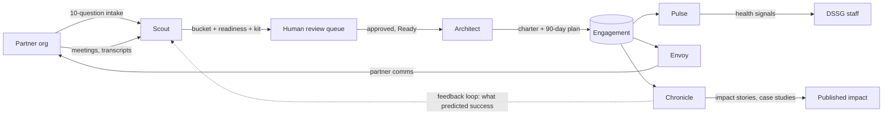
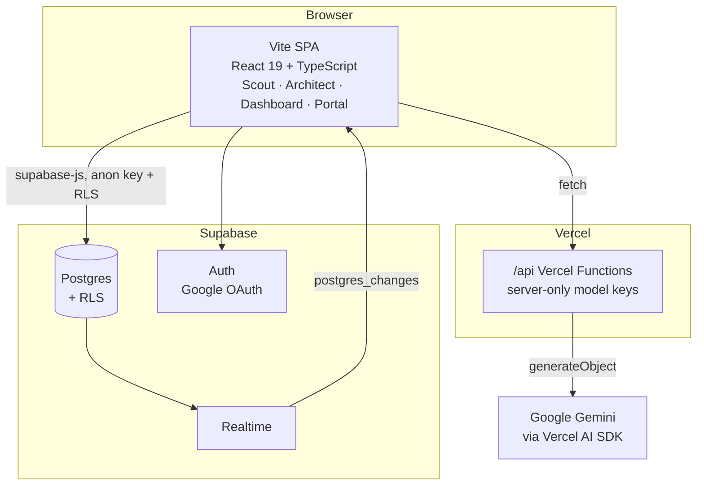
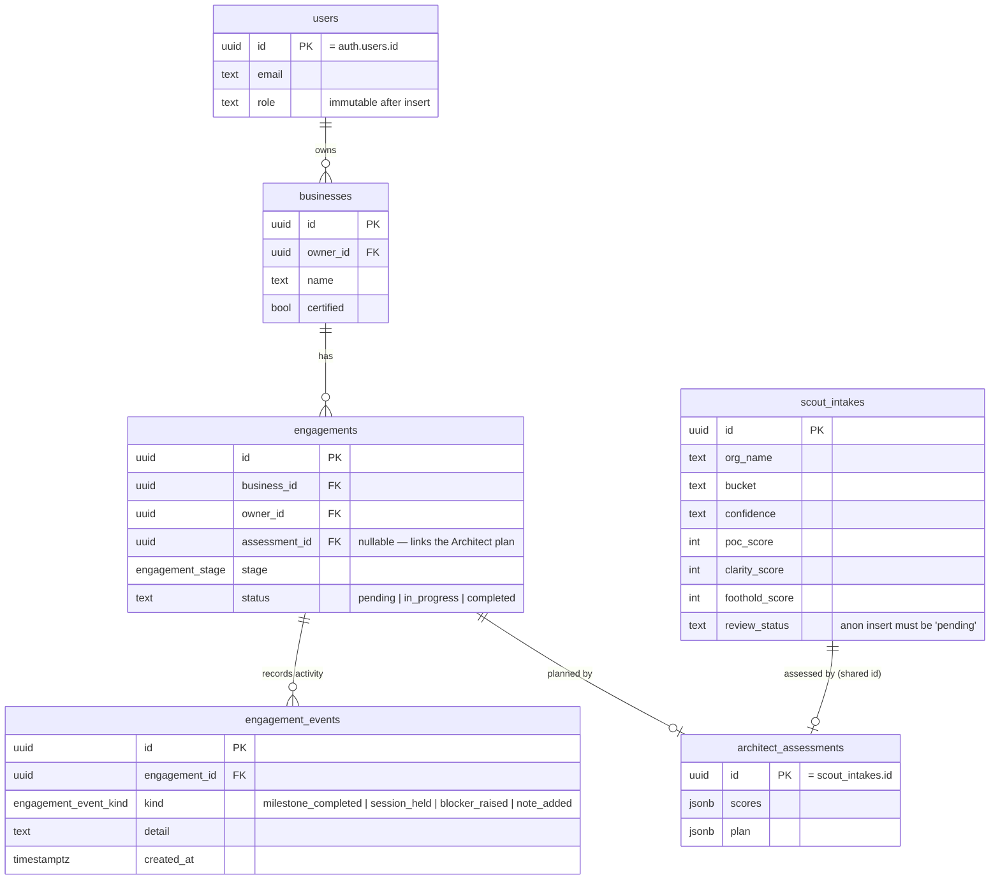

# nonprofit-success-ai — Architecture & Direction Decision

**Status:** Active — decided 2026-08-06, moved into this repo 2026-08-21
**Supersedes:** the two-repo Python split (decision log 2026-07-15) and the earlier
prototype's five-agent parity plan.

This is the decision record for what we are building, on what stack, and when that was decided.
It is the only live architecture document in this repo.

---

## 1. The decision

The **NYC-DSSG partner portal is a single repository**, and the partner-success system is
built forward from this repo's React/TypeScript codebase. There is no separate
coordination service: one repo, one language, one deployment.

This settles two earlier directions, both dead:

- A **two-repo Python split**, in which a LangGraph Coordination Service wrote
  `engagements.stage` while the portal merely rendered it.
- A **fork**, in which the agent work was prototyped against a copy of this portal. That
  prototype is where the stack decisions below, the Supabase schema, and the workflow
  tooling were worked out — but it is neither an upstream nor a downstream. This repo is
  the one that ships; any doc describing the fork as the place the work happens is stale.

### Stack decisions

| Layer | Decision | Notes |
|---|---|---|
| Frontend | React 19 + Vite 6 + TypeScript | Already in place |
| Deployment | **Vercel** — Vite SPA + Vercel Functions under `/api` | Not Next.js: the SPA stays a plain Vite build |
| Agent logic | **Vercel AI SDK** (`ai` + `@ai-sdk/google`) | Replaces both LangGraph and the current direct `@google/genai` client calls |
| Database & Auth | **Supabase** — Postgres, Auth, RLS, Realtime | Full replacement of Firebase/Firestore, not auth-only |
| Styling | Tailwind CSS 4 | See [design-interface.md](design-interface.md) |

Only the frontend and styling rows are true of the working tree today. `/api`, the AI SDK,
and the Supabase client are the target; `supabase/` holds the schema and RLS suite ahead of
that wiring. See the "Not present yet" section of [CLAUDE.md](../CLAUDE.md).

**Why a server boundary is mandatory.** The SPA has no server-side code at all, so it has
nowhere to put a model key. Its `vite.config.ts` used to inline `GEMINI_API_KEY` into the
client bundle; that was removed on 2026-08-21, before any model call existed to depend on
it. No agent may hold a model key in browser code. Every real LLM call goes through
`/api`, with keys in server-only environment variables (never `VITE_`-prefixed). This is a
precondition for agent work, not a later hardening step — the first agent path wired
without `/api` in place would have to re-introduce exactly the exposure just removed.

---

## 2. Three agents and three services

Scopes are as agreed in the 2026-08-06 meeting; the roster was resolved from five agents
to three agents plus named services on 2026-08-21 (see §5). Full specs live under
[.claude/specs/platform/](platform/) — `agents/` for the three, `services/` for the rest.

### What separates an agent from a service

**Agents reason; services execute.** An agent is a decision surface where the system
produces a judgment from unstructured or ambiguous input — a judgment a human would
otherwise make by reading and weighing. A service is deterministic: given the same inputs
it returns the same output, and a human can reproduce it by hand.

The test is the *nature of the work*, not whether a model is called today. Architect's
maturity scoring is a mechanical rubric with no model call, yet Architect is an agent —
because the charter and 90-day plan it produces are narrative synthesis. The Health
Service is threshold arithmetic over four numbers, so it is a service even though it sits
at the same point in the lifecycle Pulse once did.

| Component | Type | Scope | State |
|---|---|---|---|
| **Scout** | Agent | Light-touch intake triage and routing (~10-question form) → bucket + confidence, engagement-readiness signal, recommended onboarding kit. **Also absorbs meeting intelligence** — transcript capture, extraction, calendar coordination. | Intake built (`src/components/`, `src/lib/scoutRouting.ts`); meeting intelligence **specified** — [scout.md](platform/agents/scout.md) |
| **Architect** | Agent | 18-question current-state assessment → deterministic scoring, then charter and 90-day plan. | Built (`src/components/`, `src/lib/architectPlan.ts`, `architectScoring.ts`) — [architect.md](platform/agents/architect.md) |
| **Chronicle** | Agent | Impact statements and case studies, gated by a readiness check on the record. Carries the feedback edge into Scout. | **Specified** here; drafting built in the prototype. Feedback loop still undesigned — [chronicle.md](platform/agents/chronicle.md) |
| **Health Service** *(was Pulse)* | Service | Internal engagement-health verdict, computed per engagement on read. | **Specified** here; built in the prototype. No model path by design — [health-service.md](platform/services/health-service.md) |
| **Communications Service** *(was Envoy)* | Service | Partner communications across five occasions; drafting is L3, delivery is deterministic. | **Specified** here; drafting built in the prototype. **No send path** — [communications-service.md](platform/services/communications-service.md) |
| **Contract & Consent Gate** | Service | Server-stamped signature and immutable write. | **Specified** — [contract-consent.md](platform/services/contract-consent.md) |

**The State column records this tree, not the prototype.** Only Scout and Architect have
code here, as `src/lib/*.ts` rather than under `src/agents/`, and there is no `api/` at
all. Porting each component is its own issue; "Specified" is the target those issues close
against. In the prototype the other four are built but unwired — logic and `/api` endpoint
exist with tests, nothing in the SPA calls them. Even there, Chronicle's feedback loop into
Scout remains undesigned, and nothing has a scheduler or a send / publish path.

**Scout's meeting-intelligence extension is specified** — [scout.md](platform/agents/scout.md)
§2 supersedes the old `scout-design.md`, which was intake-only, described an n8n webhook
flow, and said nothing about meetings, transcripts, or calendars.

### Human-in-the-loop tiering

The pattern is already implemented in Scout (`src/types/scout.ts:61`, `hitlTier`) and
carries forward to every agent and to any service whose output reaches a partner:

- **L2** — high confidence and Ready: the agent acts, a human is notified, the action is reversible.
- **L3** — low confidence, or Conditional/Not Ready: the agent drafts and a human must approve
  before anything reaches the partner.

### Agent path contract

Every path that can fail — a model call, a network hop, a parse — obeys these rules,
whether it belongs to an agent or to the drafting half of a service. Scout, the
Communications Service, and Chronicle implement the first three today; rule 4 binds
nowhere yet. The Health Service has no model path at all, so rules 1–2 are satisfied
trivially: the deterministic computation is the only path.

1. **A deterministic result always exists.** Every model-backed path has a pure local
   counterpart that produces a usable result with no network call.
   `src/agents/scout/routing.ts` is that counterpart for intake routing, and the client
   calls it directly when `/api` is unreachable.

2. **Failure is signalled, never simulated.** `api/route-intake.ts:64` returns a non-2xx
   with an error body and **no result payload** when the model call throws — it does not
   fabricate a half-filled routing object. Callers can tell "the agent decided" apart from
   "the agent could not run", which rule 4 depends on.

3. **The deterministic path is tested independently of the model path.**
   `src/agents/scout/__tests__/routing.test.ts` exercises the heuristic with no model in the loop;
   `src/agents/scout/__tests__/api.test.ts` covers the schema contract shared with `/api`. Neither
   needs a key to run.

4. **Tracing attaches at the model-call boundary.** No tracing is wired up today and none
   is needed: there is one model call, single-shot and schema-validated. The seam is named
   so it stays a seam — when an agent path becomes multi-step or scheduled,
   instrumentation goes at the `/api` model call and records the fallback decision as an
   outcome, not a silent branch. Rule 2 is what makes that possible: a signalled failure
   is observable, a simulated one is not.

Architect (`src/agents/architect/scoring.ts`, `plan.ts`) is deterministic end to end
today, so rules 1 and 2 have nothing to bind. They apply the moment the enrichment noted
at `src/agents/architect/plan.ts:9-16` lands — a model call behind the same output shapes
is still a model call.

### Agent handoffs



---

## 3. System containers



The SPA reads and writes Supabase directly under row-level security using the anon key — RLS, not
the client, is the authorization boundary. `/api` exists for work the browser must not do: holding
model keys and making LLM calls.

---

## 4. Data model

Six tables. Five are translated from `supabase/reference/firestore.rules` (207 lines of
validation and authorization — still the live access control until `src/` reads Supabase)
into Postgres constraints and RLS policies; `engagement_events` is new in migration 0002,
added to give Pulse an activity signal to read.



Authorization semantics to preserve:

- **Self-scoping** — a user reads and writes only their own `users` row; `role` is immutable.
- **Owner-scoping** — `businesses` and `engagements` are visible to their `owner_id` only.
- **Public intake** — anonymous `INSERT` into `scout_intakes` is allowed, but only with
  `review_status = 'pending'`. Anonymous `SELECT` is not allowed.
- **Admin-only** — reading and updating intakes, and all access to `architect_assessments`.
  Migration 0002 also grants admins `SELECT` on **all** `engagements`, so staff can see the
  portfolio Pulse reports on. Admins read; ownership still governs writes.
- **Terminal-status lock** — a completed engagement cannot be reopened.
- **Append-only history** — `engagement_events` rows can be inserted and read by the owning
  user (and read by admins) but never updated or deleted. This is enforced **twice**: no
  `UPDATE`/`DELETE` policy exists, *and* neither privilege is granted. The privilege is the
  outer gate, so an attempted edit raises `42501` rather than silently matching zero rows —
  a stronger guarantee than a policy alone, since it cannot be reopened by adding a policy.
  Pinned by `throws_ok` assertions in `supabase/tests/rls.test.sql`.

**Realtime under RLS:** `postgres_changes` respects row-level security, so admin-only tables emit
events only to admin sessions. A non-admin subscriber sees silence, not an error — that silent drop
is the failure mode to watch when porting the portal's `onSnapshot` listeners.

---

## 5. Source reconciliation

Four documents describe this system at different scopes and they do not agree. This table
is the verdict; where a source conflicts with a row below, this row wins.

| Question | Revised design doc | PRD | Superseded org doc | **Verdict here** |
|---|---|---|---|---|
| Agent count | Three (Pulse, Envoy demoted to services) | — | Seven org-wide | **Five.** See below. |
| Model gateway | — | `/platform/` shared runtime | LiteLLM, "when the second agent ships" | **In-repo** `src/model/`. No second consumer exists; LiteLLM is a deployment concern we do not have. |
| Agent telemetry table | — | `agent_runs` | `ai_invocations` | **`agent_runs`** — the PRD's vocabulary, since that is what a collaborator will read. |
| Repo topology | — | `/platform/*` at root, shared package | Three repos incl. `platform-api` | **Single repo.** `platform-api` is backlog; this repo owns its platform layer. |
| Tenancy | — | Organization-scoped | — | **Open, recommendation = organization.** [crm/data-model.md](crm/data-model.md) §1. |
| Framework | Vercel AI SDK | — | Per-surface (LangGraph, PydanticAI, ADK) | **Vercel AI SDK** for this repo. |

### The roster: three agents, shared services

**Resolved 2026-08-21 — ratified at three agents.** This section previously argued for
keeping five; that argument is withdrawn. The roster is:

| Component | Type | Why |
|---|---|---|
| **Scout** | Agent | Reasoning over free-text intake answers |
| **Architect** | Agent | Narrative synthesis of charter + plan (scoring itself is deterministic) |
| **Chronicle** | Agent | Cross-engagement reasoning for impact synthesis |
| **Health Service** *(was Pulse)* | Service | Deterministic thresholds over structured data |
| **Communications Service** *(was Envoy)* | Service | Templates + optional AI polish; owns delivery, not occasion judgment |
| **Contract & Consent Gate** | Service | Server timestamp + immutable write |

The governing rule is **agents reason; services execute**. `computePulseSignal` is
threshold arithmetic over four numbers — a model would add latency and non-determinism to
a calculation staff must be able to reproduce by hand. That is a service.

**What the five-agent position got right, and which survives the change:**

- **The engineering detail is not lost.** `platform/services/health-service.md` and
  `communications-service.md` each carry the prior agent spec's rubric, taxonomy, and HITL
  rationale in full. Demotion changed the framing, not the content — which is why the
  service specs were written to straddle both positions.
- **Drafting and sending are genuinely different acts.** Choosing the occasion, assembling
  context, and setting tone is judgment; SMTP, templates, and retry are execution. The
  Communications Service owns both, but only the execution half is deterministic — the
  drafting half still calls a model and is still **L3, always**. A service is not
  automatically a template renderer.
- **The L4 tension is real and stays flagged.** `design-requirements.md` puts
  partner-facing communications at **L4**, its strictest tier, while describing the
  component as a tool-driven execution service. Those cannot both be true as written.
  Resolve when the send path is designed — the drafting side is L3 today and nothing
  sends, so nothing is blocked. See `communications-service.md` Open questions.
- **Envoy must not become a second system of record.** Communications history lives in the
  canonical `communications` table (`crm/data-model.md` §3), never inside the component
  that drafts.

**Why this resolution over the alternative:** the two positions never disagreed about
behavior — only about whether "agent" names a decision surface or a model call. Three
agents plus named services makes the split visible in the file tree, which is where the
next reader looks first.

---

## 6. Open items

These are decided-to-be-undecided. Each is tracked; none blocks the platform work.

- **`engagements.stage` writer (U5) — resolved 2026-08-21.** A single server-side domain
  command, `POST /api/engagement-transition`, is the only writer, for every stage and every
  actor — no agent owns lifecycle writes. See [crm/lifecycle.md](crm/lifecycle.md) §2, which
  also records that `stage` is not a cursor: `unique (business_id, stage)` makes it one row
  *per* stage, so a transition inserts rather than updates. The Health Service still only
  reads `stage` and `daysInStage`; that boundary is unchanged.
- **`engagement_events` producer.** Migration 0002 creates the table, its RLS, and its
  append-only guarantee, and Pulse reads it — but nothing writes to it yet. Until a producer
  lands, every engagement reads as `at_risk` with "no recorded activity". New with this work,
  not inherited.
- **Stage enum ratification (U7) — resolved 2026-08-21 at six stages.**
  (`initial_meeting`, `budget_check`, `data_ethics_committee`, `scoping`, `hackathon_ready`,
  `membership`) — the enum at `0001_init.sql:66-73`, matching `src/types.ts:15`,
  `firestore.rules:62`, and the portal's `STAGES` array. Earlier docs describing five predate
  the schema and are superseded. Rationale and per-stage exit conditions:
  [crm/lifecycle.md](crm/lifecycle.md) §1. Team confirmation of stage *names* is still welcome,
  but the engineering question is closed — downstream work may depend on six.
- **Scout extraction depth (U4) — resolved.** The two-type model (`decisions` /
  `action_items`) is the baseline, per [platform/agents/scout.md](platform/agents/scout.md) §2. The
  full 11-type fact taxonomy with certainty scoring from #12–#15 is a documented extension
  point, not assumed baseline scope.
- **Knowledge base / `platform-api`.** The KB workstream recommended a third repository, which
  contradicts the single-repo decision. It is parked on Chronicle (#29) to absorb or reject.

---

## 7. Platform layer and build order

### Why not `/platform/*` as the PRD writes it

The PRD's ten-directory tree (§6.2) encodes a **deployment topology this repo does not
have**. `/platform/{agents,skills,plugins,mcp,...}` makes sense when GrantPilot and Success
Portal both depend on one shared runtime package. Adopting the directory shape without the
shared package buys the cost — ten top-level directories, and a fork that no longer diffs
cleanly against upstream — and none of the benefit, because nothing is shared yet.

The distinction it is reaching for is real: **generic platform capability vs. domain-specific
agent logic.** That boundary belongs *inside* `src/`, as a rule about imports.

**Boundary rule:** the generic layer — `src/{model,schemas,guardrails,observability}` —
may not import from `src/agents/`, `src/services/`, or `src/app/`. Dependencies
point one direction only. That single rule is what makes the generic layer extractable into
a shared package later — the actual goal the PRD's structure was chasing. It is enforceable
as a lint rule.

```
src/
  model/gateway.ts     # selection, fallback, retry, cost/latency capture
  model/errors.ts      # the failure ladder, previously copy-pasted across 4 routes
  schemas/             # versioned agent/tool contracts
  guardrails/hitl.ts   # L1–L4 derivation, one place
  observability/       # agent_runs / tool_calls writer
  evals/               # graders, fixtures, targets. Imports agents; nothing imports it.
  agents/              # NSAI-specific reasoning. All five. May import the generic layer above.
  components/          # SPA screens and cards
  app/                 # SPA entrypoint (App.tsx, main.tsx)
```

The concept layers are flat under `src/` — no `platform/` wrapper — following the canonical
vocabulary in `~/.claude/refs/naming.md` §1. The import rule, not the nesting, is what
defines the boundary: `agents/` may reach into `model/`, `guardrails/`, and
`observability/`, and none of those may reach back. Extracting the generic layer later
means lifting those directories, leaving `agents/` behind.

Agent logic stays out of `src/app/`. `src/app/` is the SPA entrypoint; agent logic
is imported by both the SPA and the `api/` handlers (`api/route-intake.ts` imports
`../src/agents/scout/schema`). Filing it under `app/` invites importing React into a Vercel
Function.

### Mapping to PRD §6.2

| PRD directory | Here | Status |
|---|---|---|
| `/platform/agents` | `src/agents/` | Exists |
| `/platform/schemas` | `src/schemas/` | MVP |
| `/platform/policies` | `src/guardrails/` | MVP |
| `/platform/observability` | `src/observability/` + `agent_runs` | MVP |
| `/platform/evals` | `src/evals/` | Exists — gated in CI, see README §Tests & Evals |
| `/platform/skills` | `src/skills/` | Backlog — a registry with one consumer is a folder |
| `/platform/plugins`, `/platform/mcp`, `/platform/knowledge` | — | Backlog |
| `/platform/deploy` | `vercel.json` + CI | Backlog |

Model Gateway is in PRD §6.1 but absent from its §6.2 directory list. It is the
highest-value single piece of the platform layer.

### MVP — what it takes to run one engagement end to end

The test: can this system run one real engagement without a human doing something the
system should have done?

| # | Item | Why MVP |
|---|---|---|
| 1 | Model gateway + failure ladder | Four API routes duplicate this today. Every agent written before it becomes a separate retrofit. |
| 2 | `agent_runs` + `tool_calls` | No version recording, no Q5 monitoring, no way to debug a bad output in production without them. |
| 3 | `approvals` + `audit_events` + one approval queue | L3/L4 derive correctly but have nowhere to land outside Scout's own queue. |
| 4 | `tasks` + `milestones` as rows | Architect emits milestones as prose. Until they are rows, Pulse has nothing to measure. |
| 5 | Wire Pulse, Envoy, Chronicle into the UI | All three are built and unreachable (§2). Closest thing to free value in the repo. |
| 6 | `documents` with provenance | Cheap now, expensive to retrofit. [crm/data-model.md](crm/data-model.md) §5. |
| 7 | Turn on eval thresholds | The harness runs and gates nothing — `evals/targets.yaml` is entirely commented out. |

**Items 1 and 2 ship together** — the gateway writes to `agent_runs`, so building them
apart means building the gateway twice. All of 1–4 sit downstream of the tenancy decision.

Backlog: skills/plugin/MCP registries (a registry needs ≥2 consumers to earn its
abstraction), RAG retrieval + pgvector, three-tier agent memory, contract and e-signature,
shared Supabase project, Q3 adversarial suite, knowledge graph (deferred by the design doc
itself — agreed).

**Provider routing — long-term, deliberately deferred.** The operating budget is ~$50/month,
which makes model cost a real constraint rather than a rounding error. The default is Gemini:
its free tier plausibly covers this app's volume (intake routing plus a handful of drafts
per engagement) at zero cost, and `GOOGLE_GENERATIVE_AI_API_KEY` is the name the ported
agent code already reads. A provider router — OpenRouter, one key across many models
including Kimi and DeepSeek — is the alternative if free-tier quota or model quality turns
out to bind. It is not the current default because the AI SDK abstracts the provider behind
a single adapter call, so switching later is a small, local change; deciding early would
trade a real option for no present gain. Revisit when there is measured usage to reason
about, not before.

### Docs still to be written

[crm/lifecycle.md](crm/lifecycle.md) landed 2026-08-21 and is no longer on this list —
it closed U5 and U7.

| Doc | Lane | Satisfies |
|---|---|---|
| `platform-specs/runtime.md` | platform | PRD §6.1 — the layer above, in detail |
| `platform-specs/observability.md` | platform | PRD §5.3, §6.5 — the trace, `agent_runs` schema |
| `platform-specs/evals.md` | platform | PRD §6.5 — thresholds and gating policy, not the harness |
| `platform-specs/hitl.md` | platform | PRD §7 — L1–L4, extracted out of `CLAUDE.md` |
| `ux-specs/journeys.md` | ux | PRD §4.1, §4.3 — role journeys, approval flows, accessibility |
| `ux-specs/ai-provenance.md` | ux | PRD §4.2 — AI content visually distinct from verified data |

`ux-specs/journeys.md` and `ux-specs/ai-provenance.md` are Tony's lane — listed for completeness, not
claimed.

---

---

## 8. Execution semantics

### The command layer — AI proposes, code decides, humans authorize

The layering rule that makes the HITL contract enforceable rather than aspirational:

```
UI
 │
 ▼
/api — commands           authenticate · authorize · derive · guard · transact · emit
 │
 ├── deterministic rules (the rubrics, the health taxonomy, the transition guards)
 │
 └── agent orchestration
        │
        ▼
     model gateway ──▶ LLM   returns a PROPOSAL, never a state change
```

**A model call returns a proposal. Only the command layer turns a proposal into state.**
Every existing rule in this repo is an instance of that one:

- `hitlTier` is omitted from every model output schema and stamped server-side — a model
  cannot grant itself a tier (`src/guardrails/hitl.ts`).
- Chronicle's `readiness` is derived from the record before any model call, and omitted
  from `chronicleModelSchema` — a model cannot license its own drafting.
- Scout's `composite_signal` is recomputed server-side rather than trusted from the model
  (`platform/agents/scout.md`).
- Architect's maturity band is a deterministic rubric; the model enriches the narrative
  around it and never moves the band.
- The lifecycle transition derives `fromStage` server-side rather than accepting it from
  the caller (`crm/lifecycle.md` §2).

Stated as one invariant, so the next component inherits it instead of re-deriving it:

> **AI proposes; deterministic code decides; humans authorize; events record; outcomes
> teach the system.**

The practical test for any new agent path: *if the model returned adversarial output, what
state could it change?* The answer must be "none" — it can only produce a proposal a human
or a deterministic rule then accepts.

The rules that hold *between* components. Every component spec covers its own mechanism;
none of them owns these, which is why they went unstated until a design review asked.
Every row below is either **specified** or **explicitly deferred** — silence is not an
answer, because silence reads as "handled".

`crm/lifecycle.md` §2 and §7 state these for the transition command specifically. This
section generalizes them to every consequential command.

### What counts as a consequential command

Any server-side operation that is externally visible or hard to reverse: a lifecycle
transition, an approval, a contract signature, a partner-facing send, a publish. Each is
a `POST` to `/api`, executed server-side, and each obeys the five rules below.

Reads and drafts are not consequential — a draft that is never approved has no effect
outside the database.

### 1. Idempotency — required

Every consequential command takes an `idempotencyKey`, unique per attempt. A replay
returns the **original** result, not a second effect. Without it a double-clicked Approve
produces two approvals, two transitions, and possibly two emails.

The key is client-generated per user action, not per request, so a retry after a timeout
carries the same key as the attempt that may already have succeeded.

`crm/lifecycle.md` §2 states the concrete instance; `crm/data-model.md` §6 states it as a
standing requirement for workflow writes and external side effects.

### 2. Concurrency — deliberately deferred

**Stale writes are not detected.** There are no `version` columns and no optimistic
concurrency check.

This is a decision, not an omission. One staff team, no scheduler, and no concurrent-edit
UI means the exposure is small and the cost of the machinery is not. The accidental
backstop is `unique (business_id, stage)`: two concurrent transitions to the *same* stage
produce one success and one `23505`, mapped to `409`.

What that does **not** cover: two concurrent transitions to *different* stages race, and
the loser's write survives as an orphan `in_progress` row. If this ever matters, the
mechanism is `SELECT … FOR UPDATE` on the business row — not a `version` column, which
would have to be threaded through every client.

Revisit when either is true: more than one staff team, or any scheduled writer.

### 3. Failure taxonomy

`stack/vercel-functions.md` defines the four-rung ladder for *endpoint* failures — missing
model key, bad JSON, invalid input, model failure. Consequential commands add the rows a
ladder about endpoints cannot see:

| Failure | Behavior |
|---|---|
| Guard unmet | `422`, the unmet condition named. Never a silent no-op |
| Approval missing where required | `422`, nothing written |
| Actor not authorized | `403`, nothing written |
| Duplicate request (same `idempotencyKey`) | `200` with the original result. **Not an error** |
| Concurrent write to the same row | One success, one `409`. No partial state |
| Database unavailable mid-transaction | Postgres rolls back. No half-applied command |
| Side effect fails after commit | The command **stands**. Logged, retried out of band, surfaced to staff — never rolled back |
| Approval service unavailable | `503`. The command does not proceed unapproved |

The last two are the ones that matter most and are easiest to get wrong. A side effect
that can roll back a committed legal signature is worse than a failed email —
`platform/services/contract-consent.md` set that precedent and this generalizes it.

### 4. The async boundary — Realtime is UI synchronization, not a domain event bus

Supabase Realtime pushes row changes to subscribed clients. That is a **consequence** of a
write, never a step in one.

No workflow step may depend on a client having received an event. The failure mode this
forecloses is concrete: `db update → realtime event → frontend notices → frontend calls
API → API mutates`, which makes the business process depend on someone having a browser
tab open.

The correct direction, always:

```
command → transaction → state + event rows → (commit) → Realtime informs clients
```

If a step must happen without a user present, it is a server-side call in the command, or
it does not happen. There is no scheduler in this stack (`design-scope.md` constraints),
so "later" currently means "on the next request that needs it" — which is why the Health
Service computes on read rather than on a sweep.

### 5. Structured vs. blob

JSONB is right for a **flexible artifact** the system stores and renders whole:
`architect_assessments.plan`, a draft narrative, a model's raw output.

Relational columns are right for **queryable domain state**. The test is whether the
product needs to ask a question across rows. "Show every engagement with a milestone
overdue by more than seven days" cannot be answered from `plan JSONB` at any acceptable
cost — which is why `milestones` and `tasks` are tables in `_deferred/0006`, not fields.

The rule: **if a query the product needs would have to reach inside the blob, it is not a
blob.** Storing a plan as JSONB *and* projecting its milestones into rows is not
duplication; the blob is the artifact, the rows are the state.

## 9. Document provenance

- **2026-08-06 meeting** — the source of truth for this reversal and for the five agent scopes.
- **Prototype** — the server boundary, the Supabase re-platform, the agent buildout, and
  the eval harness were worked out in a fork before landing here. That work is now carried
  by this repo; the fork is not an upstream to stay diffable against.
